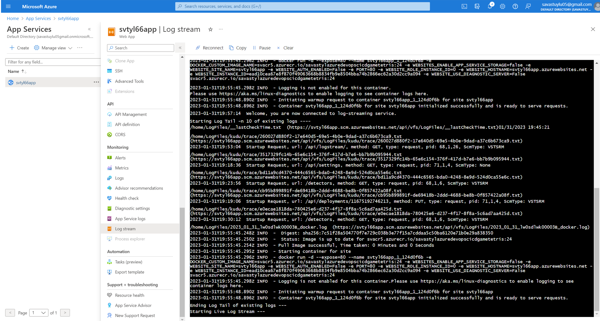

# Azure-DevOps(CI-CD)-Game(Tetris)

Azure DevOps can be used to set up a continuous integration and continuous deployment (CI/CD) pipeline for a game like Tetris. Here are the general steps to set up the pipeline:

+ Store the source code for the game in a version control system like Git, hosted in Azure DevOps.

+ Create a build definition in Azure DevOps that will compile the source code and generate the game binaries.

+ Create a release definition in Azure DevOps that will deploy the game binaries to a test environment, such as a virtual machine or a cloud-based server.

By using Azure DevOps for CI/CD, you can ensure that the game is always up-to-date and that any changes to the code are automatically tested and deployed to the appropriate environments. This helps to minimize downtime and ensure that players have the best possible experience when playing the game.

## Tetris

Tetris is a classic puzzle game where players place different shaped blocks to create full lines without gaps.
The tetris game built on HTML5 Canvas and Javascript.

## Log Stream of Application

